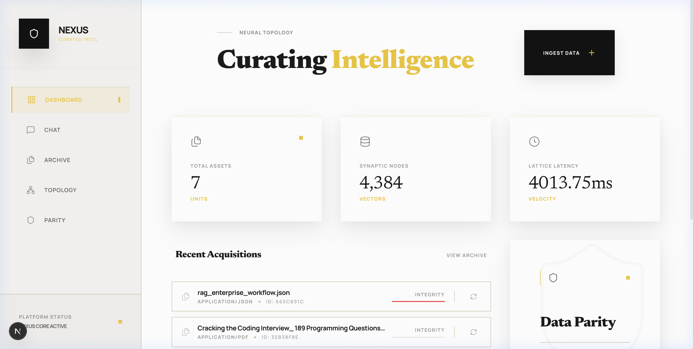
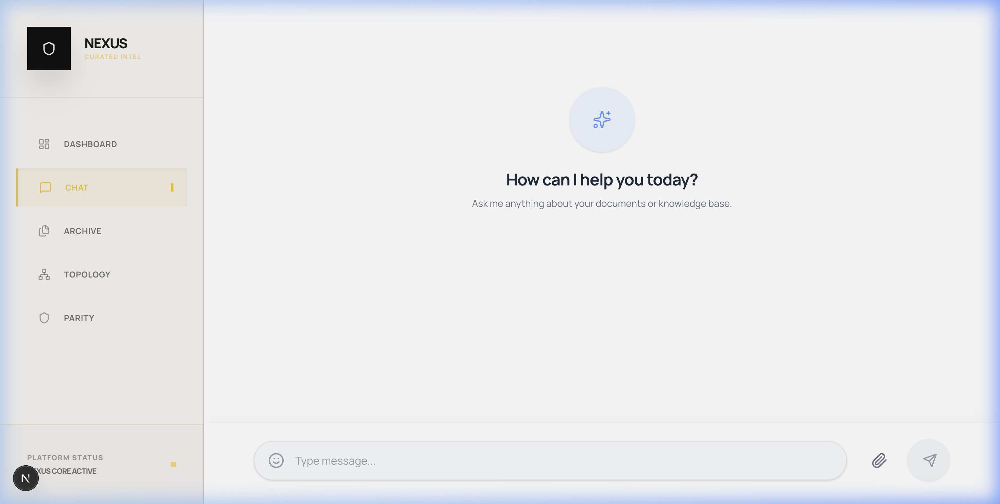
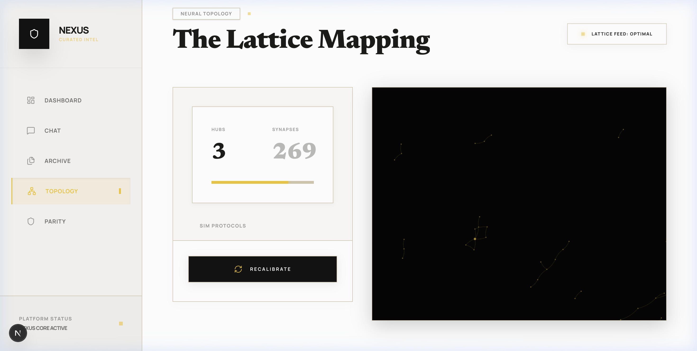
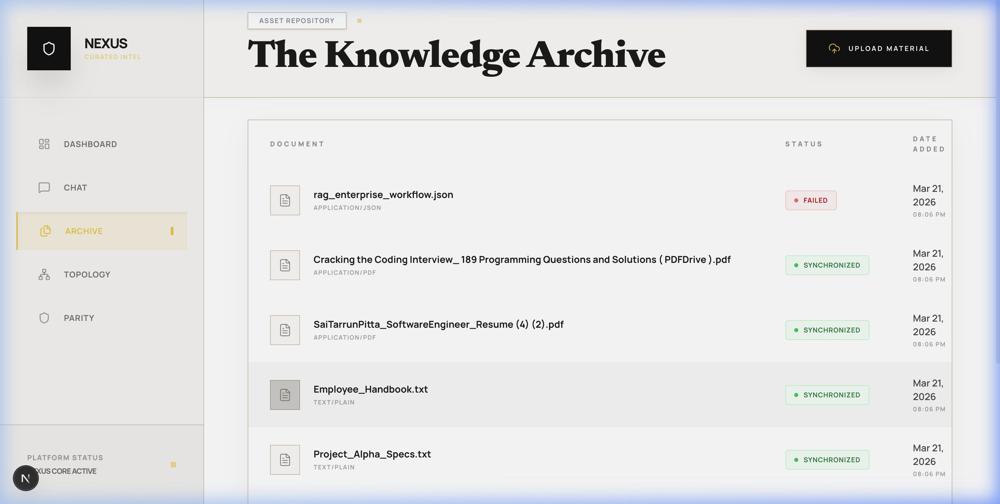
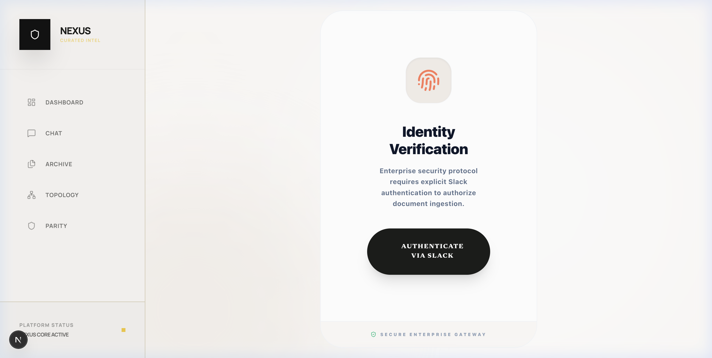
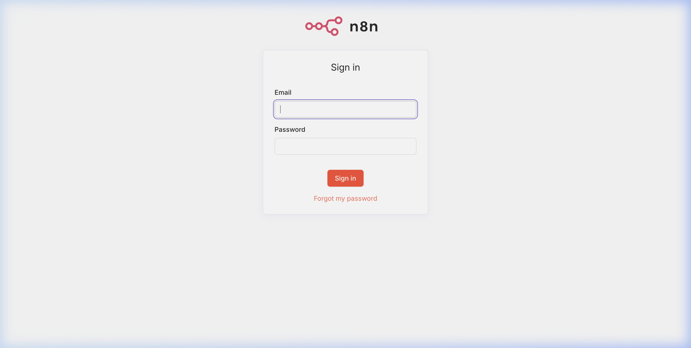

# Nexus ~ LLM-Powered-Knowledge-Retrieval-Platform

[](https://vercel.com)
[](https://github.com/saitarrun/rag-platform)

**Nexus** is an enterprise-grade, locally-sovereign Knowledge Retrieval Platform featuring a **Multi-Agent Swarm** architecture, **Knowledge Graph (Neo4j)** extraction, and **Local n8n Automation**. Designed for high-precision information extraction and curation.

## 🖼️ System Preview

### 📊 Tactical Dashboard
The central nervous system of the platform, providing real-time analytics on asset health, vector density, and system latency.


### 💬 Neural Chat Interface
Conversational intelligence with multi-agent orchestration. Features real-time streaming, grounded citations, and human-in-the-loop feedback.


### 🕸️ Neural Topology (GraphRAG)
Visualize the relationship between your data entities through the **Lattice Mapping**. High-importance hubs glow in gold, while minor synapses are rendered with high contrast.


### 📂 Knowledge Archive
Comprehensive document management with synchronization status and metadata extraction.


### 🔐 Multi-Step Approval (Slack & n8n)
Enterprise security via automated Slack approval workflows. No document enters the index without explicit authorization.



## 🛠️ Tech Stack

- **Frontend**: Next.js 15+, Tailwind CSS 4, Framer Motion, D3-Force.
- **Backend**: FastAPI (Python 3.11), SQLAlchemy, FAISS, PyMuPDF.
- **Graph**: Neo4j 5.x.
- **Automation**: n8n (Locally containerized).
- **Cache**: Redis / GPTCache (Semantic Layer).

## 🚀 Deployment Strategy

### Local (Docker)
1. **Configure Environment**: Copy `.env.example` to `.env` and update with your API keys:
   ```bash
   cp .env.example .env
   # Edit .env with your OpenAI API key and other configuration
   ```

2. **Build and Start Services**: Launch all containers (backend, frontend, Redis, Neo4j, n8n):
   ```bash
   docker-compose up --build -d
   ```

3. **Access the Platform**:
   - Frontend: http://localhost:3001
   - Backend API: http://localhost:8001/api
   - Neo4j Browser: http://localhost:7474
   - n8n Workflows: http://localhost:5678
   - Redis: localhost:6380

4. **View Logs**:
   ```bash
   docker-compose logs -f backend  # Backend API logs
   docker-compose logs -f frontend # Frontend logs
   ```

5. **Stop Services**:
   ```bash
   docker-compose down
   ```

### Production (Vercel + Managed Backend)
1.  **Frontend**: Deploy the `frontend/` directory to Vercel.
2.  **Backend**: Host the `backend/` and `neo4j/` on a VPS (e.g., Railway).
3.  **Sync**: Connect via `NEXT_PUBLIC_API_URL`.

---
*Curated with ❤️ for the future of Agentic Intelligence.*
